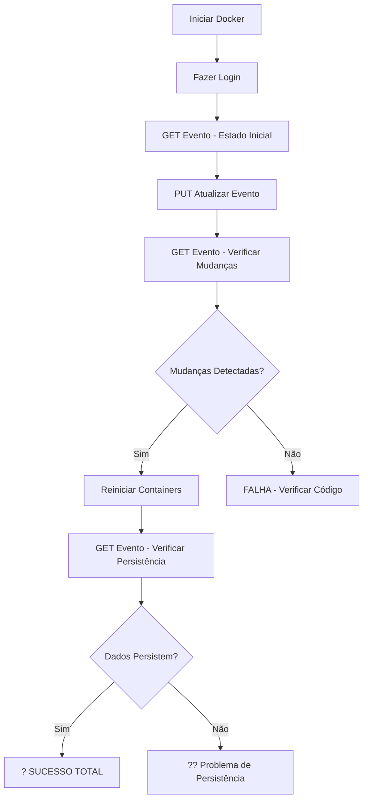

# Guia de Teste - Atualização de Eventos

## ?? Objetivo
Testar se a funcionalidade de atualização de eventos está funcionando corretamente e salvando as alterações no banco de dados MySQL.

## ?? Pré-requisitos

1. **Docker e Docker Compose** instalados e rodando
2. **Containers iniciados**: `docker-compose up -d`
3. **API rodando**: http://localhost:8080
4. **Banco de dados MySQL** inicializado com dados seed

## ?? Métodos de Teste

### Método 1: Usando o Script PowerShell (Recomendado)

Este script automatiza todo o processo de teste:

```powershell
.\test-evento-update.ps1
```

**O que o script faz:**
1. ? Faz login e obtém token JWT
2. ? Busca o evento atual (antes da atualização)
3. ? Envia requisição PUT para atualizar o evento
4. ? Busca o evento novamente (depois da atualização)
5. ? Compara os valores ANTES e DEPOIS
6. ? Consulta diretamente o banco MySQL via Docker
7. ? Mostra um resumo dos resultados

**Saída esperada:**
```
========================================
TESTE DE ATUALIZAÇÃO DE EVENTO
========================================

PASSO 1: Fazendo login...
? Login realizado com sucesso!

PASSO 2: Obtendo evento ANTES da atualização...
? Evento obtido:
  ID: 1
  Título: Feira de Ciências e Tecnologia 2025
  ...

PASSO 3: Atualizando evento...
? Evento atualizado!

PASSO 4: Obtendo evento DEPOIS da atualização...
? Evento obtido após atualização:
  ID: 1
  Título: Evento Atualizado em 2025-01-23 10:30:00
  ...

PASSO 5: Comparando mudanças...
? Mudanças detectadas:
  Título: 'Feira de Ciências...' ? 'Evento Atualizado em...'
  Departamento: 'Departamento de Computação' ? 'Departamento ATUALIZADO'
  Bloco: 'B' ? 'Z'
  Sala: '201' ? '999'
  ...

========================================
RESUMO DO TESTE
========================================
? TESTE BEM-SUCEDIDO!
```

---

### Método 2: Usando Arquivo HTTP (Manual)

Abra o arquivo `test-update-evento.http` e execute os testes sequencialmente:

#### **Passo 1: Fazer Login**
```http
POST http://localhost:8080/api/auth/login
Content-Type: application/json

{
  "email": "ana.lima@siseus.com",
  "senha": "Senha@123"
}
```
?? **Copie o token JWT retornado**

#### **Passo 2: Ver evento ANTES**
```http
GET http://localhost:8080/api/eventos/1
```
?? **Anote os valores atuais** (título, local, datas, etc.)

#### **Passo 3: Atualizar evento**
```http
PUT http://localhost:8080/api/eventos/1
Authorization: Bearer SEU_TOKEN_AQUI

{
  "id": 1,
  "titulo": "Evento Atualizado - Teste",
  "dataInicio": "2025-04-20T09:00:00",
  "dataFim": "2025-04-20T17:00:00",
  "local": {
    "campus": 0,
    "departamento": "Departamento TESTE",
    "bloco": "Z",
    "sala": "999"
  },
  "eTipoEvento": 1,
  "codigoUnico": "I1HGF9",
  "imgUrl": "https://exemplo.com/nova-imagem.jpg",
  "cpfsAvaliadores": ["12345678900"],
  "apresentacoes": []
}
```
? **Esperado: Status 204 No Content**

#### **Passo 4: Ver evento DEPOIS**
```http
GET http://localhost:8080/api/eventos/1
```
?? **Compare com os valores anteriores**

---

## ?? Verificação de Persistência no Banco

### Opção 1: Via Docker MySQL CLI
```bash
docker exec -it siseus-mysql mysql -u root -proot siseus
```

Depois execute:
```sql
SELECT 
    Id, 
    Titulo, 
    DataInicio, 
    DataFim, 
    CodigoUnico,
    ImgUrl
FROM Evento 
WHERE Id = 1;
```

### Opção 2: Reiniciar containers e verificar
```bash
# Parar containers
docker-compose down

# Iniciar novamente
docker-compose up -d

# Aguardar inicialização (30 segundos)

# Fazer requisição GET
curl http://localhost:8080/api/eventos/1
```

Se os dados persistiram, o evento deve ter as alterações feitas anteriormente.

---

## ? Checklist de Validação

Use este checklist para garantir que tudo está funcionando:

- [ ] **Atualização de título**: O título foi modificado?
- [ ] **Atualização de datas**: DataInicio e DataFim foram alterados?
- [ ] **Atualização de local**: Campus, Departamento, Bloco e Sala mudaram?
- [ ] **Atualização de imagem**: ImgUrl foi modificado?
- [ ] **Atualização de avaliadores**: Lista de avaliadores foi atualizada?
- [ ] **Atualização de apresentações**: Apresentações foram adicionadas/modificadas?
- [ ] **Persistência**: Após GET subsequente, os dados continuam alterados?
- [ ] **Persistência após reinicialização**: Após `docker-compose down/up`, os dados persistem?
- [ ] **Validação de erros**: Tentativa de código duplicado retorna erro 409?
- [ ] **Validação de datas**: Datas inválidas retornam erro 400?

---

## ?? Troubleshooting

### Problema: "Nenhuma mudança detectada"

**Possíveis causas:**
1. O método `_uow.CommitAsync()` não está sendo chamado
2. A transação está sendo revertida por algum erro silencioso
3. O Entity Framework não está rastreando as mudanças

**Solução:**
Verificar o código do `EventoServico.AtualizarEventoAsync()`:
```csharp
// Deve ter esta linha no final
await _uow.CommitAsync(cancellationToken);
```

### Problema: "Erro 500 ao atualizar"

**Verificar logs:**
```bash
docker logs siseus-backend
```

**Possíveis causas:**
- CPF de avaliador não existe
- Problema com validação de domínio
- Erro de conexão com banco

### Problema: "Status 401 Unauthorized"

**Causa:** Token JWT inválido ou expirado

**Solução:** Fazer login novamente para obter novo token

### Problema: "Status 404 Not Found"

**Causa:** Evento com ID especificado não existe

**Solução:** 
1. Listar eventos: `GET /api/eventos`
2. Usar um ID válido existente

---

## ?? Exemplo de Resultado Esperado

### Resposta do GET após atualização:
```json
{
  "id": 1,
  "titulo": "Evento Atualizado - Teste de Persistência",
  "dataInicio": "2025-04-20T09:00:00",
  "dataFim": "2025-04-20T17:00:00",
  "local": {
    "campus": "Macaé",
    "departamento": "Departamento ATUALIZADO",
    "bloco": "Z",
    "sala": "999"
  },
  "tipoEvento": "Feira",
  "codigoUnico": "I1HGF9",
  "imgUrl": "https://exemplo.com/imagem-atualizada.jpg",
  "avaliadores": [
    {
      "id": 1,
      "nome": "Ana Lima",
      "cpf": "123.456.789-00"
    }
  ],
  "participantes": [],
  "apresentacoes": []
}
```

---

## ?? Fluxo Completo de Teste



---

## ?? Anotações

### Código Analisado
O método `AtualizarEventoAsync` no `EventoServico.cs` faz:

1. ? Validação de request nulo
2. ? Busca do evento no repositório
3. ? Validação se evento existe
4. ? Validação de código único duplicado
5. ? Conversão de CPFs para IDs de avaliadores
6. ? Atualização de todos os campos do evento
7. ? **Chama `_uow.CommitAsync()`** ? IMPORTANTE!
8. ? Processa apresentações (criar/atualizar)
9. ? Tratamento de exceções

**Conclusão:** O código parece correto e deve estar salvando no banco.

---

## ?? Próximos Passos

Após confirmar que a atualização funciona:

1. ? Testar com diferentes tipos de campos
2. ? Testar atualização de apresentações vinculadas
3. ? Testar validações de negócio (datas, códigos duplicados)
4. ? Testar autorização (usuários sem permissão)
5. ? Criar testes unitários automatizados

---

## ?? Suporte

Se encontrar problemas:
1. Verificar logs: `docker logs siseus-backend`
2. Verificar banco: `docker exec siseus-mysql mysql -u root -proot siseus`
3. Validar JSON no https://jsonlint.com/
4. Verificar porta 8080 está disponível: `netstat -ano | findstr :8080`
